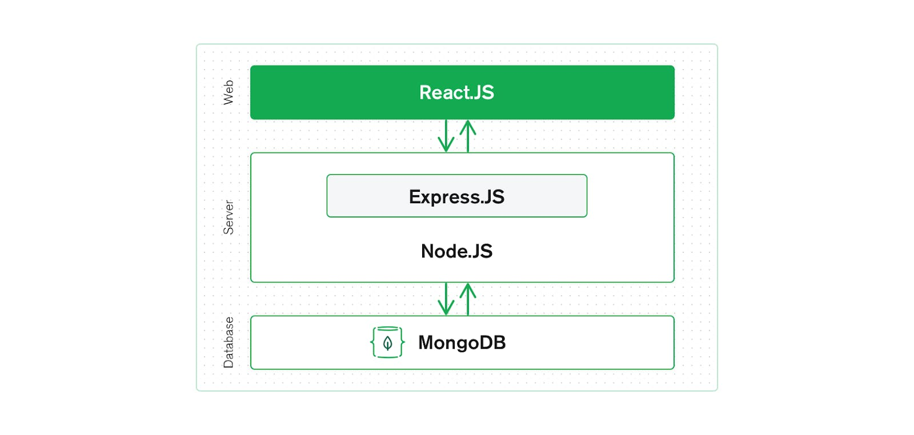
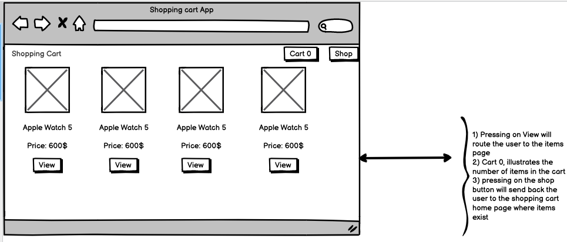
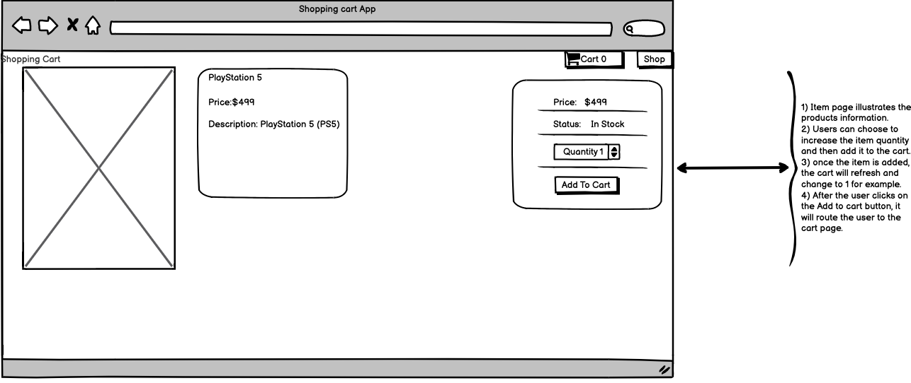
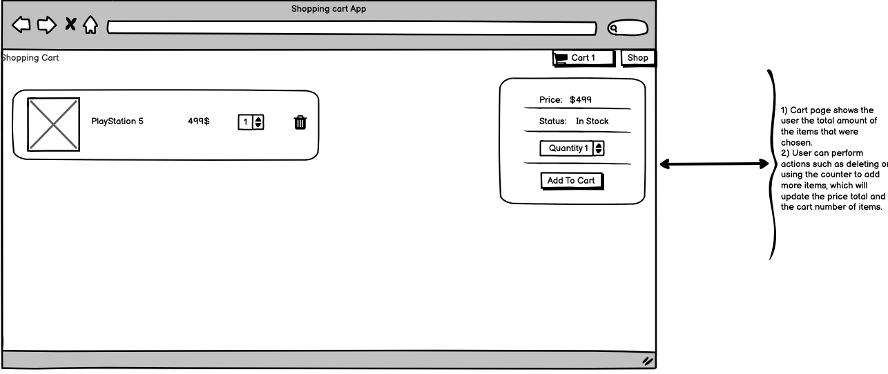

<h1> Shopping Cart - Mern Stack </h1> 

*****
*****


># 1.1 Technologies used on this web application: ✅
1) React.js: A javascript front end library for building user interfaces.
2) Express.js: A web application framework fro Node.js.
3) MongoDB: A document-based open source NoSQL database.
4) Node.js: Javascript run time environment that executes javascript code outside of a browser , such as a server.
5) Redux: A state management for React app.
6) Visual Studio Code or any other IDE you like, i personally love VS code.
7) Postman to check the api endpoints 

># Better illustration of the mern stack :
 


># 1.2 MongoDB Atlas: ✅ 
1) First of you have to head to MongoDB Atlas, and create a new project and then build a new cluster. 
2) After creating the cluster, it's time to choose which cloud provider you prefer and the the zone or region you want your data to be stored in, it's always better to choose a region which is near you. 
3) Afterwards, click on connect your application, which will connect your cluster.
4) later in the code, we will need the connection string and the password for the user that was created earlier.
   

># 1.3 Initial set-up:  🏁
1) Check if you have Node.js installed on your system by entering --> `node --version` or `node -v`
2) `npx create-react-app mern-shopping-build`, this will create a directory containing all the default project template with all the dependencies.
3) Now cd to your project folder, and enter `npm start`, this will start the project for the front end. 


># 1.4 Back-En :💡
1) Inside the root folder, mern-shopping-build, create a new folder called backend ---> `mkdir backend` this will create it for you. 
2) Afterwards, cd to that folder and enter --> `npm init -y` this will create a package.json file inside of the folder backend.
3) Now we can install some dependencies, --> `npm install express cors mongoose dotenv`, `npm install -g nodemon` , nodemon makes development easier for us, it helps develope node.js applications by automatically restarting the node application when file changes in the directory detected.
4) Now, it's time to create the backend server, in your backend directory create a file called server.js, inside this file create an express server express.json middleware (since we will be sending and receiving json), and make the server listen on port 5000.
5) Now just before moving a head run the nodemon server to check if the server is working --> `nodemon server` , you should be able to see a message in your terminal saying **server running**
6) Now it's time to connect the database with MongoDB, now create a file called `.env` in mern-shopping-build directory/ or root directory, and in the backend directory create a folder called **config** and a file inside of it called **db**.
7) Now in your `.env`, enter 3 things `port=5000`, `NODE_ENV=development`, `MONGO_URL=your url from the mangoDb, replace <password> with your own password you set up for your user. `.
8) Afterwards, head to config db and import .env, and `require('mongoose');` to connect to mongoDb. Now import that file to server.js to run and check if the server and the database are all working and connected.
9) Now there are couple of steps to create the items in the database, create two folders **models** and create product.js inside of it, another one is **data** and create  another file called products.js.
10) Afterwards, within the **models/product.js**, this is were you create the database schema using Mongoose. You can enter there the products price,image,name and so on.
11) Now in the **data/products.js** is where you actually enter the products details using the schema that we just created.
12) We need to create another folder called controller in the backend, and file called productController, this is where we getProducts/getProductsById from our database schema which is **models/product.js**
13) Now its time to create APID endpoint routes so the server can be used to perform the operations.
14) inside the backend directory folder, create a folder called **routes** and file called **productRoutes** this is where we create our routes.


># 1.5 Front-End: ☑
1) Now we are going to install dependencies we need, like react, react-dom and react-router-dom., --> `npm i react react-dom react-router-dom` 
2) Now create a folder called src, and another one called components.Inside a teh components folder we are going to create couple of files , Backdrop.js,CartItem.js, Navbar.js,Product.js and SideDrawer.js, and for each one of them create a css file.
3) Now Create a redux folder as well, and create four things , 3 folder actions, constants and reducers, create a file called `store.js`
4) Now before we start coding anything in the redux, we need to first install --> `npm i redux react-redux redux-devtools-extension redux-thunk`
5) Now in store.js, we will configure the react store, store basically holds the while state tree of our application. The most important part is to set the initial state of our store and the redux middleware, we use redux thunk as our middleware to dispatch the actions to our reducers which will change our app state.
6) Now its time to set up the action types, we have to define the different constants that will be used for the shopping cart , create a file called cartConstants.js and another file called productConstants.js :
   ```
   export const ADD_TO_CART = "ADD_TO_CART";
   export const REMOVE_FROM_CART = "REMOVE_FROM_CART";
   export const CART_RESET = "CART_RESET";
   ```
7) Now inside the productConstants.js enter : 
     ```
     export const GET_PRODUCTS_REQUEST = "GET_PRODUCTS_REQUEST";
     export const GET_PRODUCTS_SUCCESS = "GET_PRODUCTS_SUCCESS";
     export const GET_PRODUCTS_FAIL = "GET_PRODUCTS_FAIL";

     export const GET_PRODUCT_DETAILS_REQUEST = "GET_PRODUCT_DETAILS_REQUEST";
     export const GET_PRODUCT_DETAILS_SUCCESS = "GET_PRODUCT_DETAILS_SUCCESS";
     export const GET_PRODUCT_DETAILS_FAIL = "GET_PRODUCT_DETAILS_FAIL";
     export const GET_PRODUCT_DETAILS_RESET = "GET_PRODUCT_DETAILS_RESET";
     ```
8) Now head to cartActions and import all of the actiontypes from **/constants/cartConstants**, we setup the action generators, this will basically be dependant on each of the different action types we imported, we also have to dispatch them, we also import axio so we can fetch our products with id.
9) We also have to do the same thing in productActions.
10) Now we have to work with reducers, a reducer is a pure function that takes an action and the previous state of the application and returns the new state. In simple words, its a function that determines changes to an application's state.
11) Now we need to create another folder in src called screens, create 3 js files along with css files for each one for styling, **HomeScreen**, **productScreen** and **CartScreen**
12) HomeScreen, will display the UI for products, we have to import getProducts action , this will let us use the actions, we can use mapping to also display the data. 
13) ProductScreen and cart screen are also the same thing, we have to import our actions, React hooks and use them to create what we want.


>Of course this goes more in depth, but i wont be explaining it here, you can check out some articles from medium ,redux site and dev.community. These sites helped me understand how to apply the redux with my components and screens.


****
****


># 1.6 User Interface sketch :✍️
 
 
 


    

   
